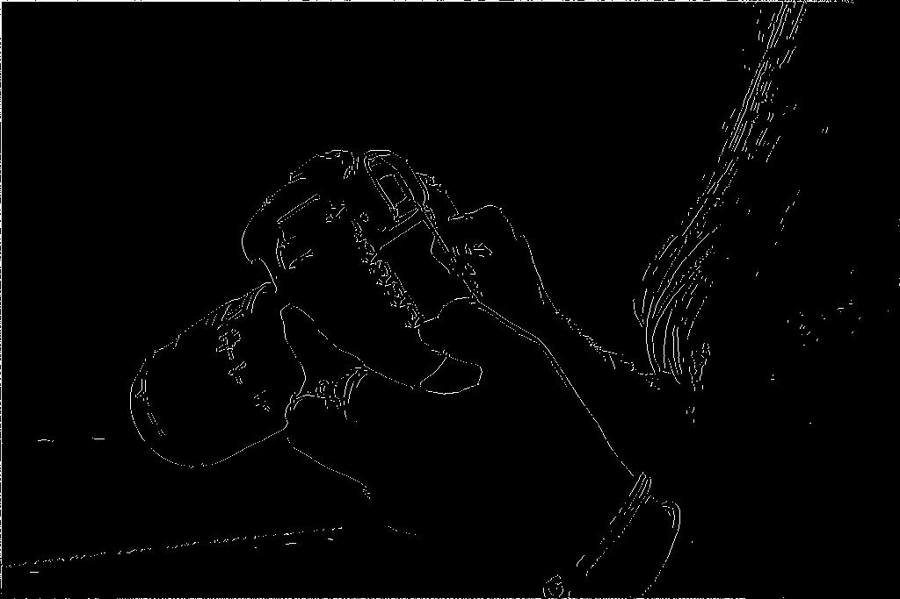

# Image Filters WIP

Create different filters on images such as blur, edge detect, greyscale,... to learn more about their algorithms.

## Original Image

## Greyscale

Create a greyscale version of the original image.

## Blur

Create a basic blur filter on the original image.

## Gaussian Blur

Create a Gaussian blur filter on the original image

## Sharpen

Create a sharpen filter on the original image

## Canny Edge Detection

